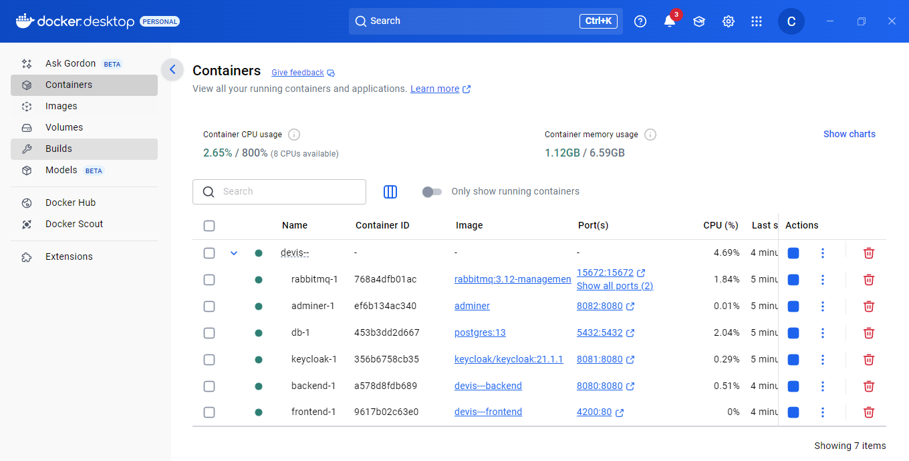
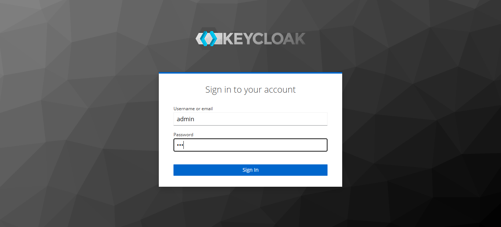
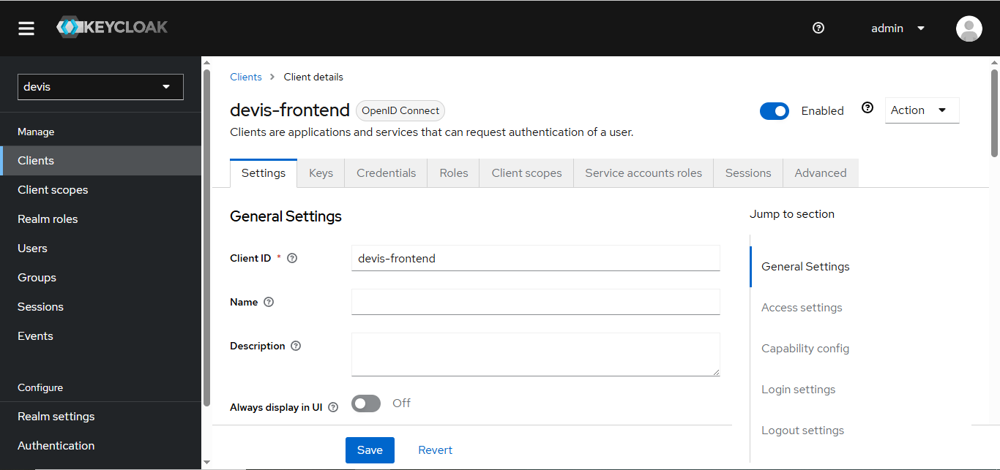
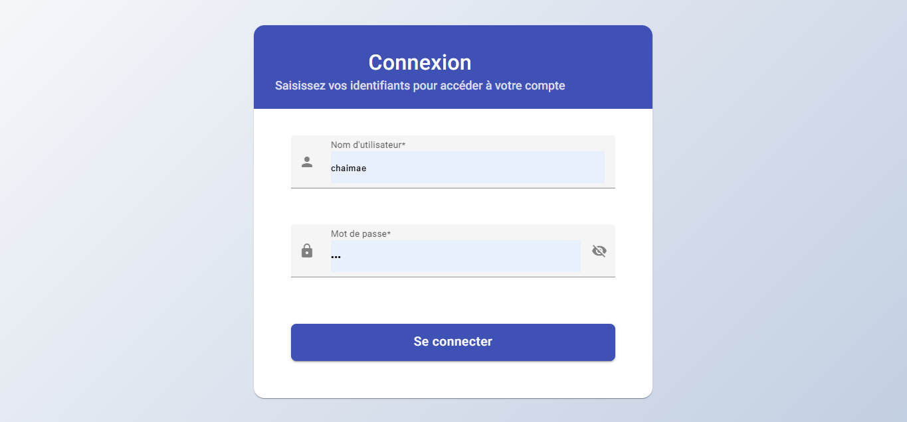
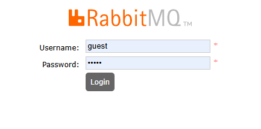
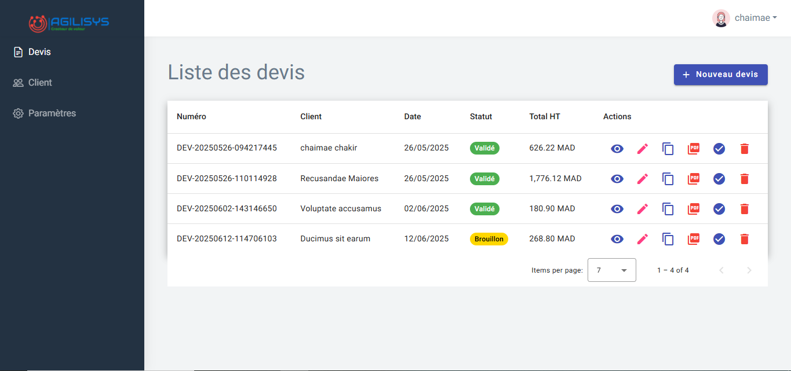
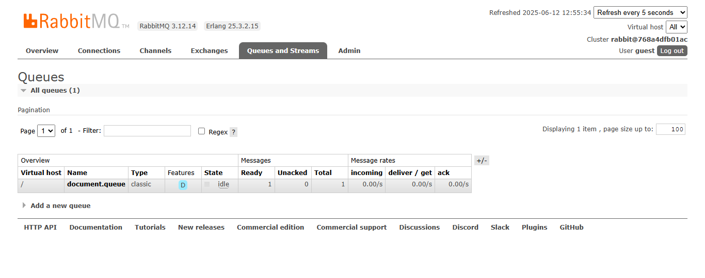
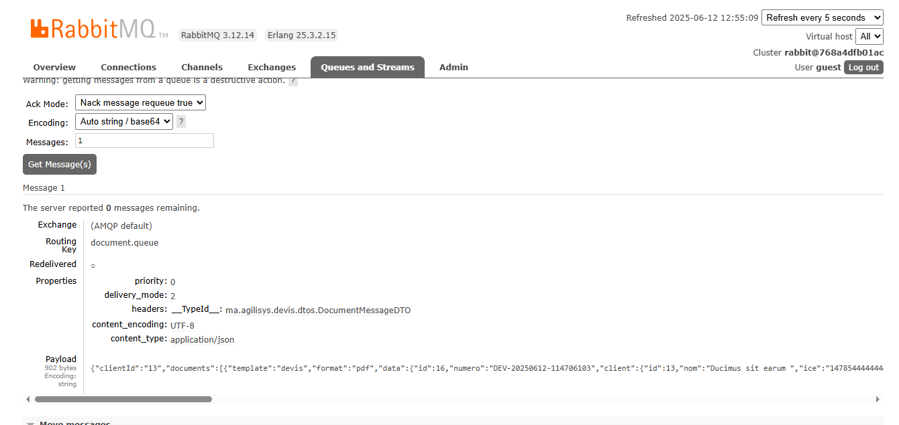
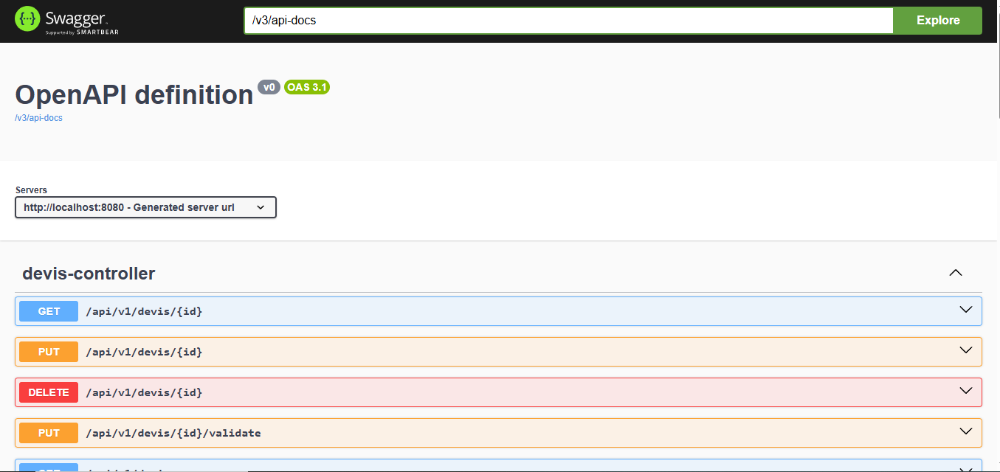
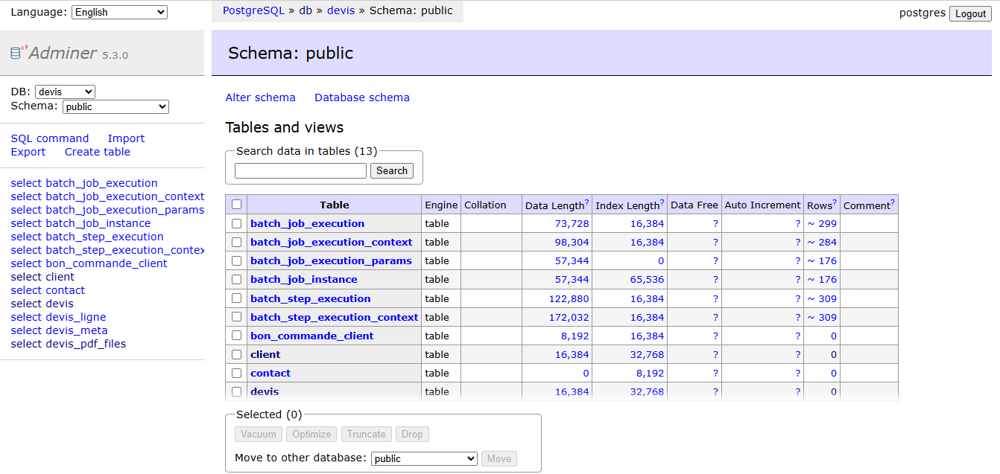

# Devis Application

This is a full-stack application for managing and generating quotes/devis. The application consists of a frontend and backend service, along with Keycloak for authentication.

## Prerequisites

Before you begin, ensure you have the following installed:
- Docker and Docker Compose
- Node.js (for local development)
- npm or yarn (for local development)

## Project Structure

```
.
├── devis/           # Backend service
├── devis_front/     # Frontend service
├── docker-compose.yml
└── init-keycloak-db.sql
```

## Quick Start with Docker

The easiest way to run the application is using Docker Compose:

1. Clone the repository:
```bash
git clone <repository-url>
cd devis--
```

2. Start the application:
```bash
docker-compose up -d
```

This will start:
- Frontend service
- Backend service
- Keycloak authentication service
- Required databases

The application will be available at:
- Frontend: http://localhost:4200
- Backend API: http://localhost:8080
- Keycloak: http://localhost:8081

## Keycloak Setup

To ensure proper functioning of the application with Keycloak, you need to perform the following configurations in the Keycloak admin console (accessible at `http://localhost:8081/admin`):

1.  **Create a Realm:**
    *   Go to `Realm settings` and create a new realm (e.g., `devis-realm`).
    *   Screenshot 2: This screenshot illustrates the process of creating a new realm in Keycloak, where you can define the realm name.

2.  **Create a Client:**
    *   Under your new realm, navigate to `Clients` and create a new client for your application (e.g., `devis-client`).
    *   Configure client settings, including valid redirect URIs (e.g., `http://localhost:4200/*`).

3.  **Create Users:**
    *   Go to `Users` and add new users for your application.
    *   Set temporary passwords for these users under the `Credentials` tab.

4.  **Create Roles:**
    *   Under `Roles`, define the necessary roles for your application (e.g., `user`, `admin`).

5.  **Assign Roles to Users:**
    *   Edit each user and assign them the appropriate roles under the `Role Mappings` tab.
    *   Screenshot 3: This screenshot demonstrates the Keycloak setup for clients, users, and assigning roles to users.

## Manual Setup (Development)

### Backend Setup

1. Navigate to the backend directory:
```bash
cd devis
```

2. Install dependencies:
```bash
npm install
```

3. Start the backend service:
```bash
npm start
```

### Frontend Setup

1. Navigate to the frontend directory:
```bash
cd devis_front
```

2. Install dependencies:
```bash
npm install
```

3. Start the frontend service:
```bash
npm start
```

### Docker Desktop - Running Containers

This screenshot shows the Docker Desktop interface with all the running containers for the application, indicating that all services are up and running.



### Keycloak Realm Creation

This image displays the Keycloak administration console during the realm creation process.



### Keycloak Client, Users, and Roles Setup

This image demonstrates the Keycloak administration console for setting up clients, creating users, and mapping roles to them.



### Additional Screenshot 4

This screenshot shows the authentication interface with the created user and password fields.



### Additional Screenshot 5

This screenshot displays the RabbitMQ management interface.



### Additional Screenshot 6

This screenshot shows the main home interface of the application.



### Additional Screenshot 7

This screenshot displays a RabbitMQ queue.



### Additional Screenshot 8

This screenshot displays another RabbitMQ queue.



### Additional Screenshot 9

This screenshot shows the Swagger documentation for the API.



### Additional Screenshot 10

This screenshot displays the database adminer interface.



## Features

- User authentication and authorization
- Quote generation and management
- PDF export functionality
- Responsive design

## Contributing

[Add contribution guidelines if applicable]

## License

[Add license information]
